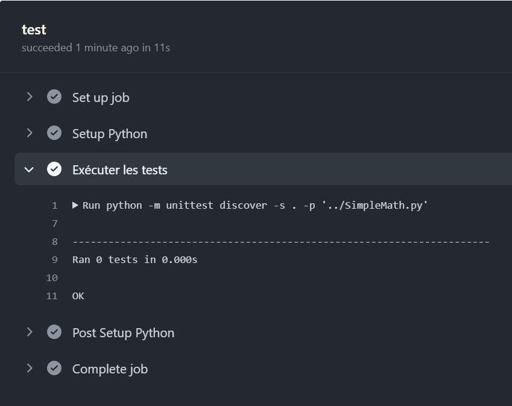

# tpGitHubAction
## 1 - Créer clé SSH lié à l'ordinateur :
Pour cela j'ai utilisé la commande suivante : 
```bash
ssh-keygen -t rsa -b 4096 -C "gardaistheo@gmail.com"
```
Grâce à cette commande un clé ssh public à été créé.
Je la récupère grâce à la commande type du cmd suivis du fichier créé et on obtient notre clée.
```bash
C:\Users\garda\.ssh>type id_rsa.pub
```
Résultat :
```bash
ssh-rsa AAAAB3NzaC1yc2EAAAADAQABAAACAQ....EZapaUe4e8eQ7IcwE+QlPTH9RZ6TF98PuoIc72lZj7gMWkWhfHWI4FkraHtlihhnL3uo9qxau5+A+Dn8qTzHiWACrJ6VIWw== gardaistheo@gmail.com
```

## 2 - Test Git Hub Action
(Le test à été affectué)
## 3 - Créer les classes pythons testé grâce à unitest :
Voici à quoi ressemble le fichier : 
```python
import unittest

class SimpleMath:
    @staticmethod
    def addition(a, b):
        return a + b

class TestSimpleMath(unittest.TestCase):
    def test_addition(self):
        result = SimpleMath.addition(3, 5)
        self.assertEqual(result, 8, "Le resultat n'est pas celui attendue")

if __name__ == "__main__":
    unittest.main()
```
## 4 - Ajouter le fichier python SimpleMath au repo et lancer les test via GitHub Action 
Après avoir suivis les instruction du TestGit Hub Action voici le fichier github-action.yml permettant de tester le fichier python : 
```yml
name: Python Tests
on: [push]
jobs:
  test:
    runs-on: ubuntu-latest
    steps:
    
    - name: Setup Python
      uses: actions/setup-python@v2
      with:
        python-version: 3.10.10

    - name: Exécuter les tests
      run: python -m unittest discover -s . -p '../SimpleMath.py'
```
Pour permettre le test il faut d'abord Setup python pour pouvoir executer unittest qui est présent dans le fichier.

Voici le résultat : 
